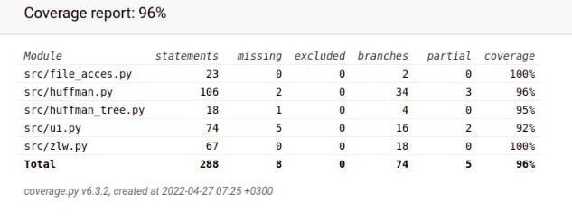
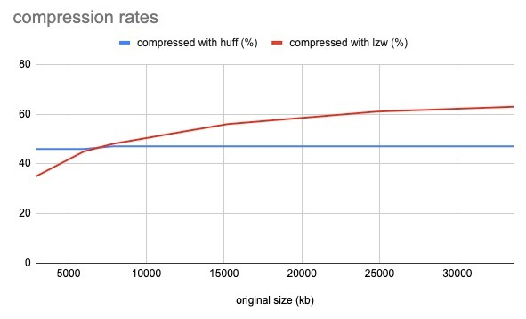

# Testing

## coverage report



## What has been tested and how

Program has mainly been tested by automated tests.
Ui, file_acces.py and both algorithms have been tested by unittests.

## How can the tests be repeated

While in Poetrys virtual enviroment
Tests can be repeated by command

````  pytest src````

And coverage raport can be generated by

```` coverage run --branch -m pytest; coverage html````

## Results of empirical testing

with huffmans algorithm the rate of compression seems to stick around 47%, and Lempel–Ziv–Welch seems to have better rates for bigger files.


