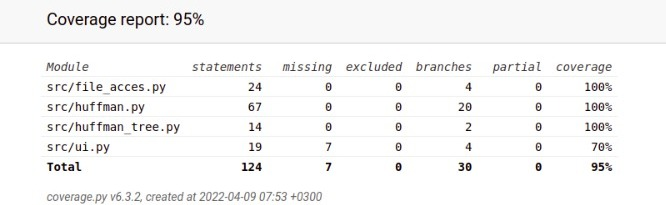

# Testing

## coverage report



## What has been tested and how

Program has mainly been tested by automated tests.
Currently unittests are focused on file_acces.py.

## What types of input were used

-

## How can the tests be repeated

While in Poetrys virtual enviroment
Tests can be repeated by command

````  pytest src````

And coverage raport can be generated by

```` coverage run --branch -m pytest; coverage html````

## Results of empirical testing

-

